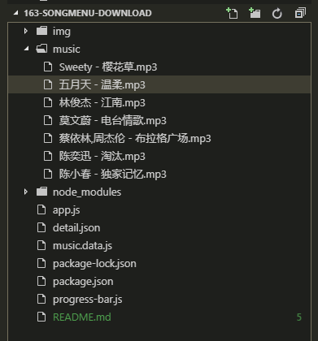

# 网易云歌单批量下载

## Description

大概实现方式

- 使用网易云接口返回音频

```shell
    # GET https://music.163.com/song/media/outer/url?id=歌曲ID.mp3
```

- 轮询改接口

- 将返回的歌曲更名, 并保存在本地 ./music

## 开始

```shell
    npm install
    node ./app
```




## 更换歌单

- 需要手动操作(感兴趣研究的同学, 可以写个自动化.)

1. 使用开发者模式 - 移动端调试模式 - 打开:

   - GET https://music.163.com/m/playlist?id=2201879658
   - id=歌单 ID

2. 找到 https://music.163.com/weapi/v3/playlist/detail?csrf_token=xxx 返回的数据;
3. 找到数据内的 data.playlist.tracks 数组 (2019.5.29)
4. 将数组替换到./music.data.js

## 扩展

1. 所有歌单列表

   - GET https://music.163.com/discover/playlist/

2. 单曲音频(重定向)

   - GET https://music.163.com/song/media/outer/url?id=歌曲ID.mp3

3. 歌单播放列表(我喜欢的音乐)

   - GET https://music.163.com/playlist?id=歌单ID
